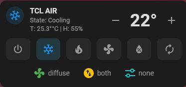
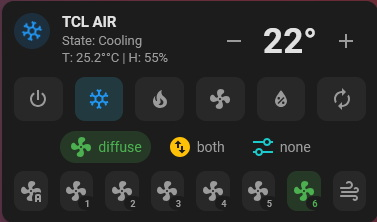
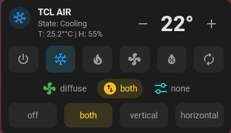
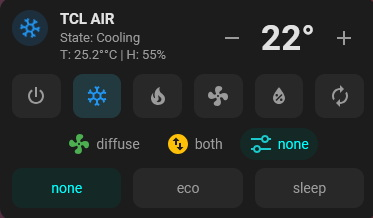

# Simply Thermostat Card

A compact, modern custom climate card for Home Assistant.

Designed for standard `climate.*` entities including ESPHome, Zigbee2MQTT, LocalTuya, IR gateways and virtual AC integrations. It provides HVAC, fan, swing and preset controls in one responsive card while automatically hiding unsupported capabilities.

## Preview

<table>
  <tr>
    <td align="center"><strong>Default</strong><br></td>
    <td align="center"><strong>Fan controls</strong><br></td>
  </tr>
  <tr>
    <td align="center"><strong>Swing controls</strong><br></td>
    <td align="center"><strong>Preset controls</strong><br></td>
  </tr>
</table>

The compact chips expand only when needed, keeping the normal card small while providing quick access to Fan, Swing and Preset options.

## Features

- HVAC, fan, swing and preset controls
- `true`, `chip`, or `false` visibility for each control group
- Adaptive fan-speed controls based on each entity's `fan_modes`
- Dynamic fan levels for 4-speed, 7-speed and other fan configurations
- Fan → Swing → Preset chip ordering
- Distinct active colors: Fan green, Swing gold, Preset cyan
- Current temperature and humidity display when provided by the entity
- Real operating state from `hvac_action` (for example Cooling vs Idle)
- Animated HVAC icon with reduced-motion support
- Automatic `target_temp_step` support
- Automatic `min_temp` / `max_temp` protection
- Home Assistant theme variables and light/dark theme support
- Keyboard-accessible native buttons and ARIA labels
- Responsive mobile layout
- Home Assistant Sections default layout: Full width, Auto height, 1-row minimum and 4-column minimum
- Built-in visual card editor
- Card picker registration and `climate` entity suggestion
- No dependency on `mwc-*` controls or Home Assistant's internal Lit implementation

## Installation

### HACS custom repository

Add this repository to HACS as a Dashboard custom repository, install **Simply Thermostat Card**, then reload Home Assistant/frontend resources.

### Manual

Copy `simply-thermostat-card.js` to:

```text
/config/www/community/simply-thermostat-card/simply-thermostat-card.js
```

Add the resource:

```yaml
resources:
  - url: /local/community/simply-thermostat-card/simply-thermostat-card.js
    type: module
```

Then hard-refresh the browser. The console should report `Simply Thermostat Card registered v2.0.5`.

## Configuration

The card can be configured from the Home Assistant visual editor or YAML.

```yaml
type: custom:simply-thermostat-card
entity: climate.living_room
show_hvac: true
show_fan: chip
show_swing: chip
show_preset: false
```

Optional settings:

```yaml
name: Living Room
step: 0.5       # omit to use entity target_temp_step, then fallback to 1
icon_size: 36
```

Visibility values:

```yaml
show_hvac: true     # always visible
show_fan: chip      # compact chip that expands controls
show_swing: false   # hidden
show_preset: chip
```

A control is also omitted when the selected climate entity does not expose the corresponding mode list.

## Fan modes

Fan controls are generated from the entity's own `fan_modes`. Standard speed entries are numbered according to their order, so an entity exposing four normal speeds receives levels 1–4 and an entity exposing seven receives levels 1–7. Special modes such as Auto, Off, Quiet/Silent/Sleep and Turbo/Powerful/Boost use dedicated icons instead of a numeric level.

## Home Assistant Sections layout

The default Sections layout requests **Full width** and **Auto height**, with a 4-column minimum and 1-row minimum. This matches the layout needed for expandable Fan, Swing, Preset and HVAC chip panels: when a panel opens, the card can grow naturally and cards below it are moved down instead of being overlapped.

Existing dashboard cards may retain layout values previously saved by Home Assistant. If an older card still uses a fixed layout, open its Layout settings and enable Auto height and Full width.

## Climate behavior

The entity state is treated as the selected HVAC mode, while `hvac_action` is used for the current operating state. This means an inverter AC can correctly show `State: Idle` while its selected HVAC mode remains `cool`.

Temperature adjustment uses the entity's `target_temp_step` unless `step` is explicitly configured. Values are clamped to `min_temp` and `max_temp` before `climate.set_temperature` is called.

## Compatibility

v2 uses a native Web Component implementation. It intentionally avoids `mwc-icon-button` and does not derive LitElement from Home Assistant private frontend elements. Standard Home Assistant elements such as `ha-card` and `ha-icon` are used for presentation.

## Credits

**Author:** Kamui Shirou / zookzon  
**Project:** Simply Thermostat Card  
**License:** MIT

The original design was inspired by Mushroom-style thermostat layouts and Simple Thermostat concepts. v2 preserves the original Simply Thermostat interaction model while modernizing its Home Assistant frontend integration.

## Version history

See [CHANGELOG.md](CHANGELOG.md) for full details.

Current development release: **v2.0.5**.
